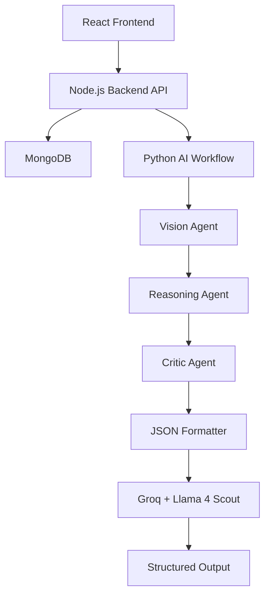
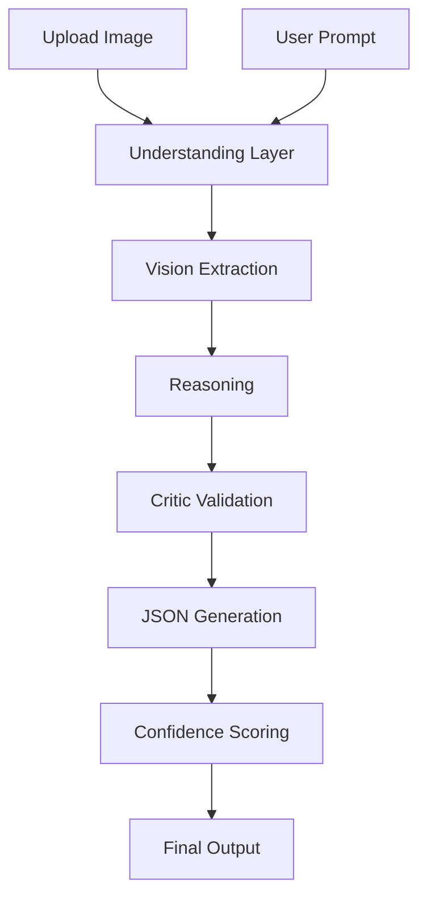
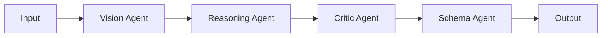
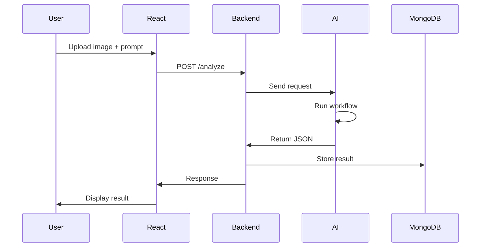

# 🧠 Multimodal Reasoning Agent Platform

<p align="center">


</p>

<p align="center">

**A modular multimodal AI system that interprets images + natural language and transforms them into structured, decision-ready outputs using reasoning agents and workflow orchestration.**

</p>

---

# 📖 Overview

Most AI vision systems stop at image captioning:

> “This image contains a receipt.”

This project goes further by combining:

- 🖼️ Image understanding
- 💬 Natural language understanding
- 🧠 Reasoning workflows
- ⚙️ Multi-agent orchestration
- 📦 Structured JSON generation

to create outputs that can directly power:

- dashboards
- automation systems
- productivity tools
- decision-support applications

Instead of simply describing images, the system reasons and generates actionable structured outputs.

---

# 🎯 Problem Statement

Traditional AI vision apps often suffer from:

❌ Hardcoded workflows  
❌ Fixed task assumptions  
❌ Unstructured outputs  
❌ Poor scalability

This project solves those problems using a generalized multimodal reasoning pipeline.

---

# 🚀 Features

### ✅ Multimodal Inputs
Accepts:
- image uploads
- text prompts
- contextual instructions

---

### ✅ Dynamic Intent Understanding

Instead of:

```python
if "receipt":
```

the system dynamically infers:
- image content
- user intent
- desired action
- expected output format

---

### ✅ Multi-Agent Workflow

The AI workflow is separated into specialized agents:

- Vision Agent
- Reasoning Agent
- Critic Agent
- JSON Formatter Agent

---

### ✅ Structured Outputs

Produces validated JSON outputs:

```json
{
  "result": {},
  "confidence": 0.91,
  "needs_review": false
}
```

---

### ✅ Confidence Scoring

Low-confidence outputs can trigger:
- human review
- fallback workflows
- additional verification

---

# 🏗️ Architecture



---

# 🔄 AI Workflow Pipeline



---

# 🧠 Multi-Agent System



---

# ⚙️ Tech Stack

## Frontend
- React
- TailwindCSS
- Axios

---

## Backend Layer
- Node.js
- Express
- MongoDB
- Mongoose

Responsibilities:
- file uploads
- API gateway
- authentication
- persistence
- request management

---

## AI Layer
- Python
- LangGraph
- Groq API
- Llama 4 Scout
- Pydantic

Responsibilities:
- multimodal reasoning
- workflow orchestration
- schema validation
- confidence scoring

---

# 📂 Project Structure

```bash
multimodal-agent/

├── frontend/
│   ├── src/
│   │   ├── pages/
│   │   ├── hooks/
│   │   ├── services/
│   │   └── components/
│
├── backend-js/
│   ├── controllers/
│   ├── routes/
│   ├── middleware/
│   ├── models/
│   ├── services/
│   └── server.js
│
├── ai-workflow/
│   ├── agents/
│   │   ├── orchestrator.py
│   │   ├── multimodal_agent.py
│   │   ├── critic.py
│   │   └── reasoner.py
│   │
│   ├── graph/
│   ├── tools/
│   ├── services/
│   └── main.py
```

---

# 🧩 Example Use Cases

## 🧾 Receipt Analysis

Input:
> Analyze my spending

Output:

```json
{
  "items": [
    {
      "name": "Milk",
      "price": 12,
      "category": "Groceries"
    }
  ],
  "total": 120
}
```

---

## 📋 Whiteboard Extraction

Input:
> Summarize tasks

Output:

```json
{
  "tasks": [
    "Finish report",
    "Email client",
    "Schedule meeting"
  ]
}
```

---

## 🛍️ Product Evaluation

Input:
> Should I buy this?

Output:

```json
{
  "decision": "skip",
  "reason": "Price higher than alternatives"
}
```

---

## 📇 Business Card Parsing

Output:

```json
{
  "name": "John Doe",
  "email": "john@email.com",
  "phone": "+123456789"
}
```

---

# 📊 Data Flow



---

# 🧪 Reliability Layer

Production AI systems need safeguards.

This project includes:

✅ Schema validation  
✅ Confidence scoring  
✅ Critic-agent review  
✅ Human-in-the-loop fallback

Example:

```json
{
  "confidence": 0.64,
  "needs_review": true
}
```

---

# 📈 Future Improvements

- Embedding-based intent routing
- Vector memory
- Agent tool use
- Evaluation dashboard
- Streaming responses
- Multi-model ensembles
- Human approval workflows

---

# 🎯 Key Learning Outcomes

This project demonstrates:

- AI system architecture
- multimodal reasoning
- LangGraph orchestration
- agent workflows
- structured generation
- backend/frontend separation
- production-oriented AI engineering

---

# 🌟 Why This Project Matters

Most AI projects are:

```text
prompt
 ↓
LLM
 ↓
response
```

This project demonstrates:

```text
inputs
 ↓
reasoning
 ↓
agents
 ↓
validation
 ↓
structured outputs
 ↓
real-world applications
```

This is closer to how production AI systems are actually designed.

---

# 👨‍💻 Author

**Amine Labibi**

AI Full-Stack Developer | AI Agents | Multimodal Systems | LangGraph | RAG

---

<p align="center">

⭐ If you like the project, consider starring the repository.

</p>
